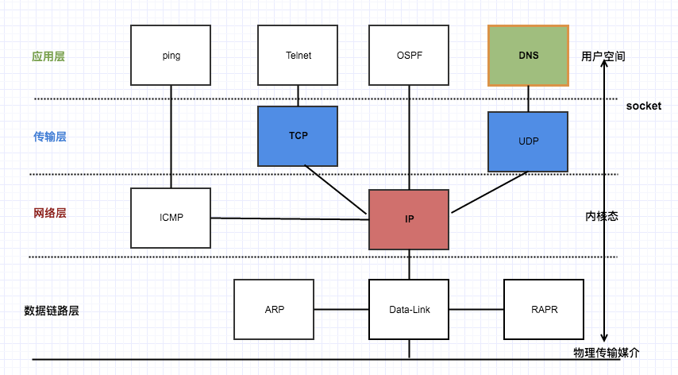
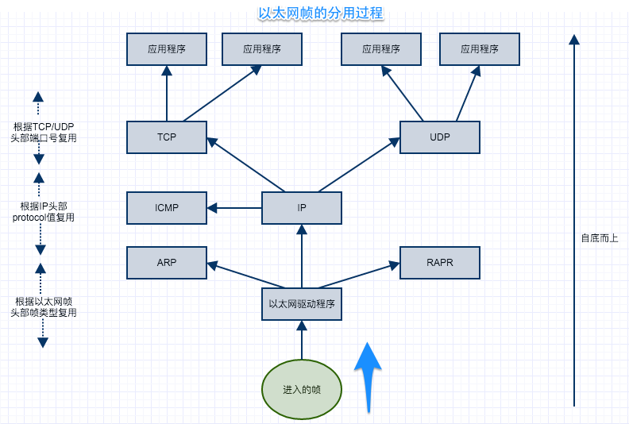

第一篇 TCPIP协议详解

- 第1章 TCPIP协议族
- 第2章 IP协议详解
- 第3章 TCP协议详解
- 第4章 TCP/IP通信案例：访问Internet上的Web服务器

# 一.TCP/IP协议族

TCP/IP协议族体系结构及主要协议如下图：

画图工具为chrome插件：Gliffy Diagrams

从下至上分析：

## 1.1 数据链路层
最底层了，它是一个**实现了网卡接口的网络驱动程序，处理数据在物理媒介如以太网，令牌环上传输， 为上层协议提供了一个统一的抽象化(隐藏细节)的接口。**

>网络层使用IP地址寻址一台机器，而数据链路层使用物理地址寻址一台机器，因此网络层必须先将目标机器的IP地址转化成其物理地址，才能使用数据链路层提供的服务，这就是ARP协议的用途。RARP协议仅用于网络上的某些无盘工作站。

上图可知数据链路层的协议主要有：

- [ARP协议](http://baike.baidu.com/subview/32698/16532303.htm?fromtitle=ARP%E5%8D%8F%E8%AE%AE&fromid=1742212&type=syn)（Address Resolve Protocol，地址解析协议)，根据IP地址获取物理地址。
- [RARP协议](http://baike.baidu.com/view/876146.htm?fromtitle=RARP&fromid=610685&type=syn)（Reverse Address Resolve Protocol，逆地址解析协议），允许局域网的物理机器从网关服务器的 ARP 表或者缓存上请求其 IP 地址。

它们实现了IP地址和机器物理地址（通常是MAC地址，以太网、令牌环和802.11无线网络都使用MAC地址）之间的相互转换。

## 1.2 网络层
>网络层实现了数据包的选路和转发。因为通信的两台主机可能不是直连的，而是通过多个中间节点（路由器）连接的。网络层的任务就是选择这些中间节点，以确定两台主机之间的通信路径。

网络层核心协议是IP协议（Internet Protocol，因特网协议），IP协议使用逐跳(hop by hop)的方式确定通信路径。

## 1.3 传输层
>传输层为两台主机上的应用程序提供端到端（end to end）的通信。与网络层使用的逐跳通信方式不同，传输层只关心通信的起始端和目的端，而不在乎数据包的中转过程。

其中传输层和网络层的区别如下图：

注释：

- 实线代表协议层的实体通信
- 水平虚线表示逻辑通信线路

**可见：**

- 数据链路层（驱动程序）封装了物理网络的电气细节；
- 网络层封装了网络连接的细节；
- 传输层则为应用程序封装了一条端到端的逻辑通信链路，它负责数据的收发、链路的超时重连等。

**传输层协议主要有三个：TCP协议、UDP协议和SCTP协议。**

## 1.4 应用层
应用层负责处理应用程序的逻辑，不涉及网络通信细节，在用户空间实现。而数据链路层、网络层和传输层这部分必须及稳定又高效，因此它们在内核空间实现。

**应用层（某些服务器程序）也可以放在内核态，这样就避免了用户空间和内核空间来回切换（主要是数据的复制）的耗时，但是会显得内核态太庞杂，不好移植，所以我们讨论用户空间的网络编程。**

应用层的协议是最多的，如：

- ping, 是应用程序，不是协议，它利用ICMP报文检测网络连接，是调试网络环境的必备工具。
- telnet协议是一种远程登录协议（明文）
- OSPF（Open Shortest Path First，开放最短路径优先）
- DNS（Domain Name Service，域名服务）

## 1.5 封装
上层协议通过封装细节与下层协议交互，每层协议都将在上层数据的基础上加上自己的头部信息（有时还包括尾部信息），以实现该层的功能，这个过程就称为封装，如

在上面的应用层知道，用户态到内核态的切换则是数据的复制，应用程序数据复制到内核态的内核缓冲区（发送缓冲区或接受缓冲区）。那么经过TCP封装后的数据称为TCP报文段，TCP头部信息和TCP内核缓冲区（发送缓冲区或接收缓冲区）数据一起构成了TCP报文段。如下TCP报文段封装过程：

经过UDP封装后的数据称为UDP数据报（UDP datagram）

与TCP封装过程类似，不同的是，UDP无须为应用程序数据保存副本，它提供的服务是不可靠的。当一个UDP数据报被成功发送之后，UDP内核缓冲区中的该数据报就被**丢弃**了。如果应用程序检测到该数据报未能被接收端正确接收，并打算重发这个数据报，则应用程序需要重新从用户空间将该数据报拷贝到UDP内核发送缓冲区中。

经过IP封装后的数据称为IP数据报（IP datagram）

经过数据链路层封装的数据称为帧（frame），传输媒介不同，帧的类型也不同。比如，以太网上传输的是以太网帧（ethernet frame），而令牌环网络上传输的则是令牌环帧（token ring frame）。

>帧的最大传输单元（Max Transmit Unit，**MTU**），即帧最多能携带多少上层协议数据（比如IP数据报），通常受到网络类型的限制。上图所示的以太网帧的MTU是**1500字节**。正因为如此，过长的IP数据报可能需要被**分片（fragment）**传输。**帧才是最终在物理网络上传送的字节序列**。至此，封装过程完成。

## 1.6 分用
上面的封装是个自上而下的封装过程，当帧到达目的主机时，将沿着协议栈自下向上依次传递。

>各层协议依次处理帧中本层负责的头部数据，以获取所需的信息，并最终将处理后的帧交给目标应用程序。这个过程称为**分用（demultiplexing）**

帧通过上述分用步骤后，最终将封装前的原始数据送至目标服务（如图中的ARP服务、RARP服务、ICMP服务或者应用程序）

## 1.7 ARP协议工作原理
ARP协议能实现任意网络层地址到任意物理地址的转换，这里只讨论从IP地址到以太网地址（MAC地址）的转换。

其工作原理可参考[百度百科](http://baike.baidu.com/subview/32698/16532303.htm?fromtitle=ARP%E5%8D%8F%E8%AE%AE&fromid=1742212&type=syn)

如主机A要与主机B通信：

1. 主机A通过路由表确定主机B的IP，然后A主机在自己的本地ARP缓存中检查主机B的匹配MAC地址。
2. 如果主机A在ARP缓存中没有找到映射，会询问B的IP的硬件地址，从而将ARP请求帧广播到本地网络上的所有主机源主机A的IP地址和MAC地址都包括在ARP请求中。本地网络上的每台主机都接收到ARP请求并且检查是否与自己的IP地址匹配。如果主机发现请求的IP地址与自己的IP地址不匹配，它将丢弃ARP请求。
3. 主机B确定ARP请求中的IP地址与自己的IP地址匹配，则将主机A的IP地址和MAC地址映射添加到本地ARP缓存中。
4. 主机B将包含其MAC地址的ARP回复消息直接发送回主机A。
5. 当主机A收到从主机B发来的ARP回复消息时，会用主机B的IP和MAC地址映射更新ARP缓存。本机缓存是有生存期的，生存期结束后，将再次重复上面的过程。主机B的MAC地址一旦确定，主机A就能向主机B发送IP通信了。

其工作原理可下图概况：

## 1.8 socket和TCP/IP协议族的关系

在第一张图中可知socket基于传输层和应用层中间，数据链路层、网络层、传输层协议是在内核中实现的。因此操作系统需要实现一组系统调用，使得应用程序能够访问这些协议提供的服务，那么**socket**系统调用的API就是用户空间和内核空间的媒介。

由socket定义的这一组API提供如下两点功能：

1. 将应用程序数据从用户缓冲区中复制到TCP/UDP内核发送缓冲区，以交付内核来发送数据（如上图所示的send函数），或者是从内核TCP/UDP接收缓冲区中复制数据到用户缓冲区，以读取数据；
2. 应用程序可以通过它们来修改内核中各层协议的某些头部信息或其他数据结构，从而精细地控制底层通信的行为。比如可以通过setsockopt函数来设置IP数据报在网络上的存活时间。

# 二.IP协议详解
主要基于IPv4学习。

IP协议是TCP/IP协议族的动力，它为上层协议提供**无状态、无连接、不可靠**的服务。

- 无状态（stateless）是指IP通信双方不同步传输数据的状态信息，优点的简单高效，速度快；缺点是无法处理乱序和重复的IP数据报，当接收到完整数据报(如IP分片的话)则传给上层协议，如果上层是TCP协议则TCP协议能够自己处理乱序的、重复的报文段。
- 无连接（connectionless）是指IP通信双方都不长久地维持对方的任何信息。这样，上层协议每次发送数据的时候，都必须明确指定对方的IP地址。
- 不可靠是指IP协议不能保证IP数据报准确地到达接收端，它只是承诺尽最大努力（best effort）。很多种情况都能导致IP数据报发送失败。比如，某个中转路由器发现IP数据报在网络上存活的时间太长（根据IP数据报头部字段TTL判断，见后文），那么它将丢弃之，并返回一个ICMP错误消息（超时错误）给发送端。又比如，接收端发现收到的IP数据报不正确（通过校验机制），它也将丢弃之，并返回一个ICMP错误消息（IP头部参数错误）给发送端。无论哪种情况，发送端的IP模块一旦检测到IP数据报发送失败，就通知上层协议发送失败，而不会试图重传。因此，使用IP服务的上层协议（比如TCP协议）需要自己实现数据确认、超时重传等机制以达到可靠传输的目的。

## 2.1 IPv4头部结构

在《图解TCP/IP》第四章的IPv4首部讲得比较详细，这里精简文字吧。

- 4位版本号指定IP协议的版本。对IPv4来说，其值是4。
- 4位头部长度（header length）标识该IP头部有多少个32 bit字（4字节）。因为4位最大能表示15，所以IP头部最长是60字节。

# 三.TCP协议详解
